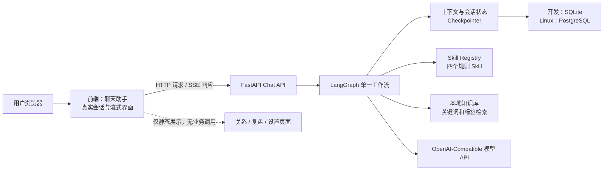

# CrushPilot 1.0.0 开发规划

## 1. 目标与范围

本版本只交付一个可用功能：**聊天助手**。用户可以在聊天页面新建或继续会话，输入问题或聊天片段，获得流式的回复建议，并继续要求更自然、更短、更暧昧、不提问或换一个。

聊天助手是完整真实链路，不是前端演示：前端通过 HTTP/SSE 调用 FastAPI；FastAPI 使用 LangGraph 管理会话、Skill 路由、知识检索、模型生成和状态保存。

截图中的「关系」「复盘」「设置」保留为展示页面，用于维持产品视觉和导航结构，但本版本不实现其数据模型、接口、模型调用、导入导出或分析逻辑。它们不得调用聊天助手以外的后端接口，也不得展示为已经计算出的真实数据。

### 明确不做

- 多 Agent、ReAct、MCP、向量数据库、微信读取或自动发送。
- 关系档案、长聊天复盘、用户画像、数据诊断、语音、图片识别、支付和复杂权限。
- 发布门禁、灰度发布与回滚机制；这些不属于当前开发阶段。

## 2. 最终运行架构



LangGraph 工作流固定为：

```text
resolve_context
  -> route_skill
  -> retrieve_knowledge
  -> generate_reply
  -> format_response
  -> save_context
```

不允许模型自主循环调用工具，也不引入额外 Agent。

## 3. 目录与模块边界

```text
CrushPilot_Terra/
├── frontend/
│   ├── src/features/chat/       # 唯一真实业务前端
│   ├── src/features/showcase/   # 关系、复盘、设置静态展示
│   └── src/lib/api/             # Chat HTTP/SSE 客户端
├── backend/
│   ├── app/api/                 # chat、threads、health
│   ├── app/graph/               # state、workflow、nodes
│   ├── app/skills/              # registry、loader、四个 Skill 定义
│   ├── app/knowledge/           # loader、retriever、scorer
│   ├── app/memory/              # checkpointer、summarizer
│   ├── app/llm/                 # 模型客户端、结构化输出
│   ├── app/schemas/             # 请求、响应、SSE 事件模型
│   └── tests/
├── knowledge/                   # 本地 YAML / Markdown 知识卡片
└── deploy/                      # Linux Docker Compose 与环境变量模板
```

第三方项目仅作为结构和知识来源；不将其完整 Fork 为运行时依赖，不执行任何第三方脚本。迁移或改写的内容需要保留对应许可证与来源记录。

## 4. 分阶段开发计划

### Phase 0：工程初始化与展示壳

- 建立前端、后端、知识库、部署目录及基础说明。
- 前端按参考截图搭建导航、聊天页和三个静态展示页。
- 只有聊天页配置 API 客户端；静态展示页使用本地固定文案和示意数据。
- 后端建立 FastAPI、配置加载、`GET /health`、统一错误响应、Ruff 与 Pytest。

完成标准：前后端均能本地启动；聊天页与展示页可访问；`/health` 返回正常状态。

### Phase 1：会话与 LangGraph 最小闭环

- 定义 `CrushChatState`：消息、`thread_id`、当前 Skill、关系阶段、用户目标、风格偏好、检索结果、摘要与最终输出。
- 建立最小 LangGraph 与 SQLite Checkpointer。
- 实现线程列表、线程读取、线程删除，以及同一 `thread_id` 的多轮状态恢复。
- 上下文默认保留最近 12 条完整消息；超出部分生成摘要；不建立永久用户画像。

完成标准：服务重启后可恢复已有会话；同一线程能基于前文继续追问。

### Phase 2：模型层与结构化输出

- 实现 OpenAI-Compatible 模型客户端，所有密钥和地址来自环境变量。
- 定义 Pydantic 响应模型：`skill`、`judgement`、`recommended_reply`、两个 `alternatives` 与可选 `warning`。
- 为超时、网络错误和结构化输出解析失败提供明确错误；JSON 解析失败自动重试一次。

完成标准：合法模型输出可校验；非法输出、超时和缺少配置时均返回可识别错误，不导致服务进程退出。

### Phase 3：四个 Skill 与本地知识库

- 建立 `reply-suggestion`、`reply-rewrite`、`cold-recovery`、`date-invitation` 四个 YAML Skill 定义。
- 基于用户意图、关键词、关系阶段、最近消息和风格要求进行规则路由。
- 将参考资料整理为 YAML 或带 Front Matter 的 Markdown 知识卡片，包含适用场景、原则、正反例、原因和风险级别。
- 使用关键词与标签评分检索；限制每次注入的知识数量和总字符数。
- 在 Prompt 和输出约束中落实不油腻、不连续追问、不情绪勒索、不过度推进等边界。

完成标准：四类典型输入命中预期 Skill；每次生成均有受限、可追溯的知识检索结果。

### Phase 4：Chat API 与 SSE

- 实现 `POST /api/v1/chat`，接受 `thread_id` 和用户消息。
- 定义稳定的 SSE 事件：开始、增量文本、结构化完成、错误、结束。
- 实现 `GET /api/v1/threads`、`GET /api/v1/threads/{thread_id}`、`DELETE /api/v1/threads/{thread_id}`。
- 将 Context、路由、检索、生成、格式化和保存串为单一主链路。

完成标准：API 能流式返回生成过程；完成事件包含符合 PRD 的结构化最终结果；线程接口与 Checkpointer 数据一致。

### Phase 5：聊天助手前端真实联调

- 聊天页面实现新建会话、历史会话列表、消息区、输入框、发送按钮和流式内容渲染。
- 前端通过 `fetch` / SSE 消费 `POST /api/v1/chat` 的事件，不直连模型服务。
- 展示推荐回复、两条备选和简短判断；支持复制。
- 将「更自然」「更短」「更暧昧」「不提问」「换一个」转换为当前 `thread_id` 下的新消息，复用同一后端主链路。
- 静态展示页保持不可用或仅呈现状态，不能误触发聊天 API。

完成标准：浏览器中完整跑通“新建会话 -> 发送问题 -> 流式结果 -> 快捷改写 -> 刷新后继续对话”。

### Phase 6：安全、测试与 Linux 运行准备

- 增加输入与输出安全规则，拒绝威胁、骚扰、跟踪、情绪勒索、强迫纠缠、身份欺骗与未成年人性相关请求。
- 完成后端镜像、前端静态构建镜像、Docker Compose、Linux 环境变量模板和部署说明。
- Linux 环境使用 PostgreSQL Checkpointer 和持久卷；开发环境继续使用 SQLite。
- 配置反向代理以正确转发 SSE，并关闭响应缓冲；密钥仅通过服务器环境变量或受控密钥文件注入。

完成标准：在干净 Linux 主机上通过 Docker Compose 启动前端、后端和 PostgreSQL；浏览器可完成聊天流式请求；容器重启后会话仍可恢复。

## 5. 单元测试（UT）要求

UT 从每个模块开始编写，不能只依赖最后的浏览器冒烟。

| 模块 | 必须覆盖的 UT |
|---|---|
| 配置与健康检查 | 缺失必填配置、合法配置、`/health` 响应 |
| State 与 Checkpointer | 新线程初始化、消息追加、12 条窗口与摘要触发、SQLite 会话恢复 |
| Skill Registry 与路由 | 四个 Skill 加载、典型意图路由、模糊输入回退、风格改写指令 |
| 知识检索 | 标签/关键词评分、关系阶段过滤、结果上限、字符数上限、空结果 |
| 模型客户端 | 正常结构化输出、非法 JSON 后一次重试、超时、网络异常、Pydantic 校验失败 |
| LangGraph 节点与工作流 | 节点输入输出、主链路节点顺序、保存失败不导致服务崩溃 |
| Chat 与 Threads API | 请求校验、SSE 事件顺序、完成结果、错误事件、列表/读取/删除会话 |
| 前端聊天状态 | SSE 事件消费、流式增量显示、完成结果渲染、快捷改写携带当前线程、失败提示 |
| 静态展示页 | 不创建 API 客户端请求；固定内容能够渲染 |
| 安全规则 | 每类禁止请求至少一条拒绝或安全引导用例 |

除 UT 外，Phase 5 和 Phase 6 各保留一次浏览器端冒烟：验证真实 SSE、会话连续性和 Linux 容器运行，不把它们替代为单元测试。

## 6. 开发顺序与检查点

1. 先完成 Phase 0 和 Phase 1，确认会话 API、State 与 Checkpointer 边界。
2. 完成 Phase 2 至 Phase 4 后，进行中途自审：核对是否仍只有一个 Graph、四个 Skill 和本地规则检索；发现功能扩张时停止扩张。
3. 再进行 Phase 5 前后端联调，静态展示页不得扩大为真实功能。
4. 最后进行 Phase 6 的安全收口与 Linux 容器化验证。

## 7. 当前待确认项

- Linux 服务器发行版、CPU/内存、是否已有域名和 HTTPS 入口。
- 生产使用的 OpenAI-Compatible 模型地址、模型名、鉴权方式与网络可达性。
- PostgreSQL 是随 Docker Compose 自建，还是接入既有托管实例。

这些信息不阻塞前五个阶段，但在 Phase 6 开始前必须明确。
