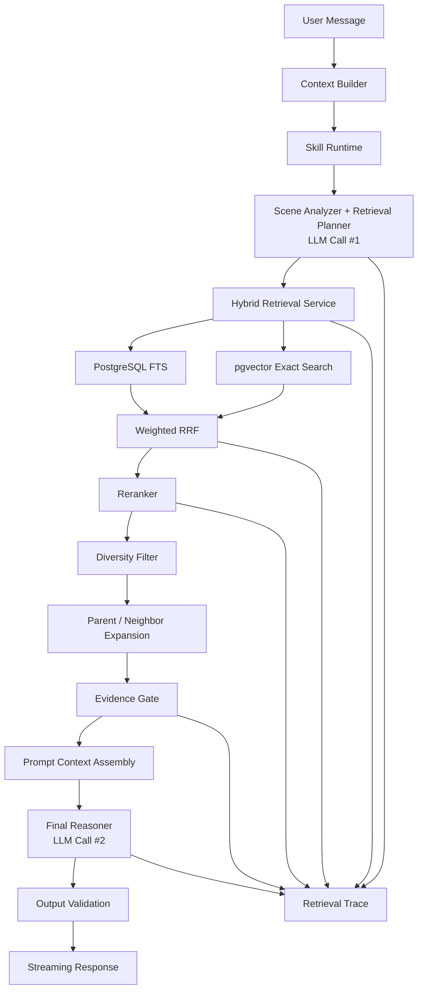
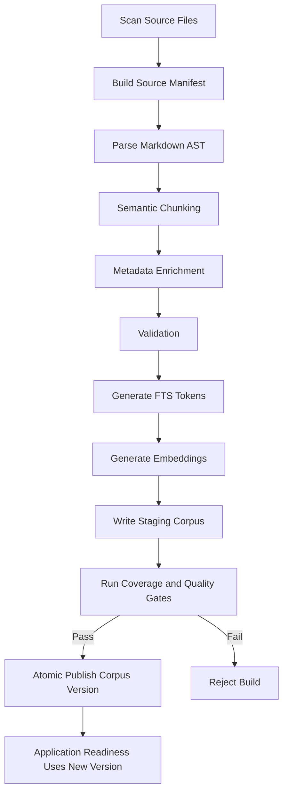

# CrushPilot 检索系统与 Skill Runtime 技术设计

> 文档状态：Architecture Approved / Implementation Pending
> 版本：v1.0
> 适用分支：`codex/feature-opt-1.0.1-sanitized` 及后续检索重构分支
> 知识规模假设：在线知识源不超过 100 篇 Markdown 文档
> 工作流约束：使用 Trellis 管理规格、任务、实现、检查与收敛

---

## 1. 文档目的

本文定义 CrushPilot 下一代知识检索与领域 Skill Runtime 的目标架构、模块边界、数据模型、在线调用链、离线摄取链、降级策略、可观测性、测试 Gate 和迁移步骤。

本文是技术设计基线，不是概念讨论稿。除非后续通过 ADR 明确修改，Codex 实现应以本文为准，不得通过缩小知识范围、抽取少量代表文档或保留隐藏旧链路来降低实现工作量。

---

## 2. 背景与当前问题

当前实现已经具备基础的 LangGraph 编排、意图分析、关键词检索、向量检索、安全知识卡和最终生成链路，但距离成熟检索系统仍有以下结构性问题：

1. **场景分析只依赖当前消息**，无法稳定理解“那我这样回可以吗”这类依赖前文的问题。
2. **知识存在双通道**：结构化卡片检索与硬编码完整 Markdown 路由同时注入，无法统一排序、审计和评测。
3. **混合检索没有统一排名模型**：关键词与向量候选主要通过拼接、去重截断处理，不是真正的融合排序。
4. **完整文档直接进入上下文**，导致 Token 浪费、无关内容污染以及来源粒度过粗。
5. **Skill、Prompt、知识路由职责混合**，行为规则与知识检索难以独立演进。
6. **向量索引生命周期不完整**，索引缺失或过期时容易静默退化。
7. **缺少 Retrieval Trace 和离线排序评测**，回答不合适时无法定位错误发生在哪一层。
8. **知识摄取范围不受机器 Gate 约束**，Codex 可能只处理部分文档后宣称完成。

本次重构不以“增加同义词、增加路由表、增加 Prompt 长度”为方向，而是建立统一、可观测、可版本化的检索子系统。

---

## 3. 设计目标

### 3.1 功能目标

- 每次回答都执行唯一的狗头军师领域 Skill。
- 场景分析必须利用当前消息、最近对话和已确认关系事实。
- 所有 approved 知识源统一进入同一个版本化 Corpus。
- 同时支持关键词精确召回和语义召回。
- 通过 RRF 融合和 Reranker 精排选择最终证据。
- 仅注入相关 Chunk，禁止整篇 Markdown 进入生成 Prompt。
- 当证据不足、冲突或系统降级时，行为必须明确、可追踪。
- 每次请求都能重建完整检索决策链。

### 3.2 工程目标

- 模块职责清晰，可独立测试和替换。
- 检索算法使用确定性代码实现，不依赖生成模型隐式排序。
- 知识版本、Skill 版本、Embedding 模型版本可追溯。
- 索引缺失、版本不匹配和数据损坏不得静默视为正常状态。
- 保留现有 FastAPI、ChatService、LangGraph、SSE 和会话持久化外围。
- 使用 Trellis 强制需求覆盖、知识源覆盖和最终收敛。

### 3.3 非目标

本阶段不实现：

- Elasticsearch 或 OpenSearch；
- 知识图谱；
- 多 Skill Router；
- 多 Agent 检索；
- 在线自动训练；
- 自动根据单次反馈改写知识；
- ANN/HNSW 优化；
- 通用文档 OCR 或复杂表格解析；
- 为保证“有结果”而动态降低阈值并注入弱相关内容。

---

## 4. 已批准架构决策

| ID | 决策 |
|---|---|
| ADR-001 | 系统只有一个狗头军师 Skill，每次回答强制参与，不实现 Skill Router。 |
| ADR-002 | Skill 是领域行为与决策策略，不再承担知识文件路由和文档目录职责。 |
| ADR-003 | 使用结构化 `skill.yaml` 作为运行时唯一事实源，`SKILL.md` 由构建脚本生成，禁止双向手工维护。 |
| ADR-004 | 默认只调用生成式大模型两次：场景/检索规划一次，最终回答一次。 |
| ADR-005 | 全部在线知识统一转化为 `KnowledgeChunk`，取消安全卡与完整文档双通道。 |
| ADR-006 | 使用 PostgreSQL FTS + pgvector 精确向量搜索，不引入独立搜索集群。 |
| ADR-007 | 中文 FTS 使用应用侧分词并写入 PostgreSQL `tsvector`，避免依赖难部署的数据库分词扩展。 |
| ADR-008 | 关键词和向量候选使用 Weighted RRF 融合，再使用独立 Reranker 精排。 |
| ADR-009 | Parent/Neighbor Expansion 只发生在 Rerank 之后。 |
| ADR-010 | 无证据是正常业务状态；索引缺失、版本不一致是系统异常状态。 |
| ADR-011 | 知识规模小于 100 篇时，pgvector 使用精确搜索，不启用 HNSW。 |
| ADR-012 | 全部知识源必须通过自动 Source Manifest 登记，禁止只摄取代表样本。 |

---

## 5. 总体架构



### 5.1 核心职责划分

| 组件 | 回答的问题 |
|---|---|
| Context Builder | 当前上下文中已经确定了什么？ |
| Skill Runtime | 系统在该领域应如何思考、决策和表达？ |
| Scene Analyzer | 当前到底发生了什么？ |
| Retrieval Planner | 本次需要检索什么，必须覆盖什么，必须排除什么？ |
| Retrieval Service | 哪些知识片段与当前问题相关？ |
| Reranker | 哪些候选最适用于完整场景？ |
| Evidence Gate | 当前证据是否足以支持相应决策？ |
| Final Reasoner | 如何结合场景、规则和证据形成最终建议？ |
| Retrieval Trace | 为什么系统最终使用了这些知识？ |

---

## 6. 大模型参与边界

### 6.1 LLM Call #1：场景分析与检索规划

输入：

- 当前用户消息；
- 最近原始对话；
- 较早对话摘要；
- 当前关系对象的已确认事实；
- Skill Runtime 中的核心推理规则；
- Skill Runtime 中相关场景的检索策略。

输出必须符合 `SceneAndRetrievalPlan` Schema，不输出用户可见文本。

大模型负责：

- 理解口语、省略和指代；
- 结合多轮上下文还原当前事件；
- 区分事实、推断和未知；
- 判断用户真正目标；
- 生成 1 至 3 条语义完整的检索 Query；
- 给出 required、optional、excluded topics。

大模型不负责：

- 扫描知识文件；
- 计算关键词分数；
- 计算向量相似度；
- 融合排序；
- 决定 Corpus 版本；
- 判定索引是否可用。

### 6.2 LLM Call #2：最终回答生成

输入：

- `SkillRuntimeView`；
- `ConversationContext`；
- `SceneSnapshot`；
- 精排后的 Evidence Set；
- `EvidenceAssessment`；
- 用户输出偏好。

大模型负责：

- 判断是否需要回复、延迟回复或不回复；
- 将知识用于决策而非机械拼接；
- 生成自然、符合上下文的解释和话术；
- 明确区分确定结论和不确定推断。

### 6.3 可选第三次调用

仅当 Evidence Gate 检测到以下情况时，允许条件性使用一次 Evidence Adjudicator：

- 高分候选之间存在相反行动建议；
- required topics 已覆盖，但适用条件明显冲突；
- 无法通过结构化元数据判断证据冲突。

该调用默认关闭，由 Feature Flag 控制。不得把第三次调用作为普通路径。

---

## 7. Skill Runtime 设计

### 7.1 Skill 的最终角色

Skill 不是知识库，也不是搜索索引。Skill 是 CrushPilot 的领域策略层，负责：

1. 规定场景分析方法；
2. 规定事实、推断与未知的边界；
3. 规定各场景下的决策原则；
4. 规定检索主题的强制覆盖和排除规则；
5. 规定知识使用优先级；
6. 规定最终输出结构与表达约束。

### 7.2 文件结构

```text
backend/src/app/agents/assistant/resources/goutoujunshi_skill/
├── skill.yaml          # 唯一运行时事实源
├── SKILL.md            # 由 skill.yaml 自动生成，仅供阅读和审查
└── schema.json         # skill.yaml 的 JSON Schema
```

### 7.3 `skill.yaml` 结构

```yaml
metadata:
  id: goutoujunshi
  version: 2.0.0
  language: zh-CN

core_rules:
  - id: fact_inference_separation
    priority: critical
    instruction: 区分已知事实、合理推断和未知信息。

  - id: no_single_signal_diagnosis
    priority: critical
    instruction: 不得根据单次回复、一次拒绝或单一行为推导稳定人格或长期关系结论。

  - id: reciprocity_first
    priority: high
    instruction: 决策必须考虑双方投入、边界与长期互动趋势。

scene_policies:
  explicit_rejection:
    required_topics:
      - rejection
      - boundary
      - reduce_pressure
    excluded_topics:
      - aggressive_pursuit
      - manipulation
    reasoning_rules:
      - 将本次拒绝与长期关系判断分开。
      - 明确拒绝后不继续施压。

  emotional_support:
    required_topics:
      - emotional_support
      - low_pressure_communication
    excluded_topics:
      - forced_disclosure

output_policy:
  order:
    - objective_assessment
    - recommended_action
    - optional_message
  constraints:
    - 避免把推断写成事实。
    - 用户询问怎么回复，不代表系统必须建议回复。
    - 话术必须符合用户语言风格。
```

### 7.4 构建与版本校验

构建流程：

```text
skill.yaml
  → JSON Schema Validation
  → Skill Compiler
  → SkillRuntimeConfig
  → Generate SKILL.md
  → Compute SHA-256
```

应用启动时必须验证：

- `skill.yaml` Schema 合法；
- 编译产物存在；
- 源文件 Hash 与编译产物记录一致；
- Skill Version 可解析；
- 核心规则不为空；
- 必需场景策略存在。

验证失败时 Readiness 必须失败，不允许使用旧缓存静默启动。

---

## 8. Context Builder

### 8.1 输入范围

默认使用：

- 当前消息：1 条；
- 最近原始消息：最多 12 条；
- 较早对话结构化摘要：最多 1 条；
- 当前关系对象的已确认事实：最多 20 条；
- 用户长期表达偏好：最多 10 条。

最近消息数量是上限，不是固定数量。Context Builder 应按 Token Budget 截断，并优先保留：

1. 当前事件相关消息；
2. 明确拒绝、承诺、边界和计划；
3. 最近一轮对话；
4. 普通寒暄。

### 8.2 数据模型

```python
class ConversationMessage(BaseModel):
    role: Literal["user", "counterpart", "assistant"]
    content: str
    created_at: datetime | None

class ConfirmedFact(BaseModel):
    fact_id: str
    relationship_id: str | None
    content: str
    source_message_ids: list[str]
    confidence: Literal["explicit", "confirmed"]

class ConversationContext(BaseModel):
    current_message: str
    recent_messages: list[ConversationMessage]
    conversation_summary: str | None
    relationship_id: str | None
    relationship_facts: list[ConfirmedFact]
    user_preferences: list[ConfirmedFact]
```

### 8.3 约束

- 模型推断不得自动保存为 `ConfirmedFact`；
- 不同关系对象的记忆必须隔离；
- 历史检索结果不得自动继承到当前请求；
- 旧知识必须根据当前场景重新检索。

---

## 9. Scene Analyzer 与 Retrieval Planner

### 9.1 数据模型

```python
class SceneSnapshot(BaseModel):
    task_type: Literal[
        "reply",
        "relationship_analysis",
        "invitation",
        "conflict_repair",
        "emotional_support",
        "boundary",
        "relationship_exit",
        "general_advice",
    ]

    relationship_stage: str | None
    current_event: str
    user_goal: str

    known_facts: list[str]
    uncertain_inferences: list[str]
    key_unknowns: list[str]

    counterpart_signals: list[str]
    explicit_boundaries: list[str]
    active_skill_scenarios: list[str]

    confidence: float


class RetrievalPlan(BaseModel):
    queries: list[str]                 # 1-3 条
    required_topics: list[str]
    optional_topics: list[str]
    excluded_topics: list[str]

    hard_filters: dict[str, list[str]]
    soft_preferences: dict[str, list[str]]

    lexical_top_k: int = 20
    vector_top_k: int = 20
    fusion_top_k: int = 20
    rerank_top_k: int = 15
    final_top_k: int = 6

    need_parent_context: bool = True
    allow_no_evidence: bool = True


class SceneAndRetrievalPlan(BaseModel):
    scene: SceneSnapshot
    retrieval: RetrievalPlan
```

### 9.2 生成约束

- Query 不能只是复制用户原句；
- Query 必须包含当前事件和用户目标；
- 最多生成 3 条 Query；
- 明确拒绝、分手、边界场景必须产生对应 required topic；
- excluded topic 用于阻止方向相反的知识进入最终证据；
- `known_facts` 必须能追溯到输入上下文；
- 无法确定的信息必须写入 `key_unknowns`，不得编造。

### 9.3 示例

用户上下文：

```text
对方：最近真的很忙，先不见面了。
用户：那我这样回可以吗？
```

输出：

```json
{
  "scene": {
    "task_type": "reply",
    "relationship_stage": "dating",
    "current_event": "对方拒绝当前邀约",
    "user_goal": "体面回应且不继续施压",
    "known_facts": ["对方表示当前不见面"],
    "uncertain_inferences": ["无法确认是短期忙碌还是长期意愿下降"],
    "key_unknowns": ["对方未来是否愿意再次见面"],
    "counterpart_signals": ["拒绝当前邀约"],
    "explicit_boundaries": ["当前不见面"],
    "active_skill_scenarios": ["explicit_rejection"],
    "confidence": 0.91
  },
  "retrieval": {
    "queries": [
      "对方明确拒绝当前邀约后如何体面回应",
      "邀约被拒后如何降低推进压力"
    ],
    "required_topics": ["rejection", "boundary", "reduce_pressure"],
    "optional_topics": ["relationship_uncertainty"],
    "excluded_topics": ["aggressive_pursuit", "relationship_escalation"],
    "hard_filters": {"review_status": ["approved"]},
    "soft_preferences": {"task_type": ["reply"]},
    "lexical_top_k": 20,
    "vector_top_k": 20,
    "fusion_top_k": 20,
    "rerank_top_k": 15,
    "final_top_k": 6,
    "need_parent_context": true,
    "allow_no_evidence": true
  }
}
```

---

## 10. 统一知识 Corpus

### 10.1 摄取范围

强制摄取：

```text
resources/goutoujunshi_source/references/knowledge/**/*.md
resources/goutoujunshi_source/references/practical/**/*.md
```

不进入在线 Corpus：

- `SKILL.md`：迁移到 Skill Runtime；
- `documentation/`：作为工程文档保留；
- `scripts/`：作为构建工具保留；
- README、变更日志等非领域知识文档；
- 经人工批准标记为 `approved_excluded` 的文件。

### 10.2 Source Manifest

系统必须通过脚本扫描生成：

```yaml
corpus_version: 2026.07.1
source_root: resources/goutoujunshi_source/references
sources:
  - source_id: KB-001
    path: knowledge/03-依恋理论与情绪调节.md
    sha256: "..."
    required: true
    status: ingested
    chunk_count: 14
```

允许状态：

- `ingested`
- `approved_excluded`

禁止在发布版本中出现：

- `pending`
- `unknown`
- `sample_only`
- `later`

### 10.3 `KnowledgeChunk` 数据模型

```python
class KnowledgeChunk(BaseModel):
    chunk_id: str
    document_id: str
    parent_section_id: str | None

    title: str
    heading_path: list[str]
    content: str
    section_summary: str | None

    knowledge_type: Literal[
        "hard_rule",
        "principle",
        "strategy",
        "example",
        "counterexample",
        "source_note",
    ]

    topics: list[str]
    task_types: list[str]
    relationship_stages: list[str]
    action_labels: list[str]

    applicable_when: list[str]
    not_applicable_when: list[str]

    evidence_level: Literal["L1", "L2", "L3", "L4"]
    review_status: Literal["draft", "approved", "rejected", "deprecated"]
    priority: int

    source_path: str
    source_sha256: str
    corpus_version: str
```

### 10.4 Chunk 策略

采用 Heading-Aware Semantic Chunking：

1. 解析 Markdown AST；
2. 以标题层级构造 Section；
3. 以完整观点、规则、案例或操作步骤为语义边界；
4. 目标长度 250-600 Tokens；
5. 最大长度 900 Tokens；
6. 小于 120 Tokens 的相邻片段优先合并；
7. 仅在超长段落内部切分时保留 60-100 Tokens 重叠；
8. 表格、列表和引用块尽量保持整体；
9. 每个 Chunk 必须保留父章节与来源 Hash；
10. 任何 required 文档生成 0 个 Chunk 时构建失败。

### 10.5 元数据生成

元数据分为两类：

**确定性生成：**

- source path；
- heading path；
- parent section；
- source hash；
- corpus version；
- token count。

**离线模型建议：**

- topics；
- applicable_when；
- not_applicable_when；
- action_labels；
- knowledge_type。

离线模型建议必须通过 Schema Validation。即使模型元数据缺失，Chunk 仍可通过 FTS 和 Vector 检索；但缺失比例必须进入构建报告。

初始迁移中，上游知识目录视为 approved source，Chunk 默认继承 `review_status=approved`。后续新增来源必须显式审核。

---

## 11. 数据库设计

### 11.1 表结构

```text
knowledge_documents
knowledge_sections
knowledge_chunks
knowledge_embeddings
knowledge_corpus_versions
retrieval_traces
retrieval_trace_candidates
```

### 11.2 关键字段

#### `knowledge_chunks`

```sql
id                  uuid primary key
document_id         uuid not null
parent_section_id   uuid null
title               text not null
heading_path        jsonb not null
content             text not null
metadata            jsonb not null
search_tokens       text not null
search_vector       tsvector not null
review_status       varchar not null
source_sha256       varchar not null
corpus_version      varchar not null
created_at          timestamptz not null
```

索引：

```sql
CREATE INDEX idx_chunks_search_vector
ON knowledge_chunks USING GIN(search_vector);

CREATE INDEX idx_chunks_metadata
ON knowledge_chunks USING GIN(metadata);

CREATE INDEX idx_chunks_corpus_status
ON knowledge_chunks(corpus_version, review_status);
```

#### `knowledge_embeddings`

```sql
chunk_id            uuid not null
embedding_model     varchar not null
embedding_dimension integer not null
embedding           vector not null
corpus_version      varchar not null
primary key(chunk_id, embedding_model, corpus_version)
```

知识规模小于 100 篇时不建立 HNSW 索引，使用精确余弦搜索。

---

## 12. 中文关键词检索

### 12.1 分词决策

采用应用侧中文分词器生成稳定 Token 序列，再使用 PostgreSQL `simple` 配置构建 `tsvector`。

原因：

- 部署不依赖数据库扩展；
- 分词版本可以进入 Corpus Version；
- 离线构建和在线 Query 使用同一实现；
- 可单元测试和回放。

### 12.2 字段权重

```text
A：标题、主题、action_labels
B：章节标题、applicable_when、not_applicable_when
C：正文
D：来源说明
```

使用 `ts_rank_cd` 计算词法得分。

### 12.3 Query 构建

对每个 Retrieval Query：

1. 中文分词；
2. 去除停用词；
3. 保留否定词和关系词；
4. required topics 作为高权重词；
5. excluded topics 作为候选过滤或负向标签；
6. 返回 Top 20。

---

## 13. 向量检索

### 13.1 默认实现

- 存储：pgvector；
- 距离：Cosine Distance；
- 搜索：Exact Search；
- Query：`RetrievalPlan.queries`；
- 每条 Query 返回 Top 20；
- Embedding 模型通过配置管理，不写死在业务代码中。

### 13.2 版本约束

Corpus Version 必须记录：

```text
embedding_model
embedding_dimension
embedding_normalization
tokenizer_version
chunker_version
```

运行时模型与 Corpus Metadata 不匹配时：

- 向量检索不可用；
- Readiness 失败，除非显式启用 `ALLOW_LEXICAL_ONLY_STARTUP`；
- 如果允许降级，必须输出指标和 Trace。

---

## 14. Weighted RRF 融合

### 14.1 默认参数

```yaml
rrf:
  k: 60
  lexical_weight: 0.45
  vector_weight: 0.55
  primary_query_weight: 1.0
  secondary_query_weight: 0.8
  fusion_top_k: 20
```

### 14.2 算法

```python
def weighted_rrf(
    lexical_ranks: dict[tuple[str, int], int],
    vector_ranks: dict[tuple[str, int], int],
    query_weights: list[float],
    k: int = 60,
    lexical_weight: float = 0.45,
    vector_weight: float = 0.55,
) -> dict[str, float]:
    scores: dict[str, float] = {}

    for query_index, query_weight in enumerate(query_weights):
        chunk_ids = {
            chunk_id for chunk_id, qi in lexical_ranks if qi == query_index
        } | {
            chunk_id for chunk_id, qi in vector_ranks if qi == query_index
        }

        for chunk_id in chunk_ids:
            score = 0.0
            lexical_rank = lexical_ranks.get((chunk_id, query_index))
            vector_rank = vector_ranks.get((chunk_id, query_index))

            if lexical_rank is not None:
                score += lexical_weight / (k + lexical_rank)

            if vector_rank is not None:
                score += vector_weight / (k + vector_rank)

            scores[chunk_id] = scores.get(chunk_id, 0.0) + query_weight * score

    return scores
```

原始 BM25/FTS 分数和 Cosine 分数只用于 Trace，不直接相加。

---

## 15. Reranker

### 15.1 输入

Reranker 输入格式：

```text
[SCENE]
current_event + user_goal + explicit_boundaries

[QUERY]
primary retrieval query

[DOCUMENT]
chunk title + heading path + chunk content
```

### 15.2 执行参数

- RRF 后 Top 15 进入 Reranker；
- 最终保留 Top 6；
- Reranker 作为独立接口，支持本地模型或服务端模型；
- 默认使用支持中文的多语言 Cross-Encoder；
- 最终模型必须通过项目 Golden Dataset 选择，不以公开榜单直接决定。

### 15.3 降级

Reranker 不可用时：

- 使用 RRF 排名继续处理；
- `fallback_reason=reranker_unavailable`；
- 增加降级计数指标；
- 不允许回到旧的硬编码文档路由。

---

## 16. Diversity Filter 与上下文扩展

### 16.1 Diversity Filter

精排后按以下规则选择：

1. 同一 Chunk 去重；
2. 同一文档最多 2 个核心 Chunk；
3. 高度重叠 Chunk 只保留最高分；
4. required topics 必须尽量覆盖；
5. `excluded_topics` 命中的候选直接排除；
6. `not_applicable_when` 与当前场景明显冲突时排除；
7. 优先选择 principle/strategy，example 只能作为补充。

### 16.2 Parent / Neighbor Expansion

仅对最终入选的 Chunk 执行：

- 如果 Chunk 依赖上文定义，补充父章节摘要；
- 如果 Chunk 是步骤中间段，补充前后相邻片段；
- 同一父章节只展开一次；
- 不读取完整文档；
- 扩展内容不参与 Reranker 分数，只作为语境补充。

### 16.3 Token Budget

默认 Evidence Budget：3500 Tokens。

分配顺序：

1. 核心 Chunk；
2. required topic 的缺失补充；
3. 父章节摘要；
4. 相邻片段；
5. 案例。

超过预算时从低分案例开始裁剪。

---

## 17. Evidence Gate

### 17.1 数据模型

```python
class EvidenceAssessment(BaseModel):
    status: Literal[
        "sufficient",
        "partially_sufficient",
        "conflicting",
        "insufficient",
    ]

    covered_topics: list[str]
    missing_topics: list[str]
    excluded_topic_hits: list[str]
    conflicting_chunk_ids: list[str]
    selected_chunk_ids: list[str]
    fallback_reason: str | None
```

### 17.2 确定性判断规则

`insufficient`：

- 无候选；
- 所有候选被 excluded/not-applicable 过滤；
- required topics 完全未覆盖。

`partially_sufficient`：

- 至少一个 required topic 未覆盖；
- 只有案例，无原则或策略支持；
- Reranker 整体置信度低于离线校准阈值。

`conflicting`：

- 高分候选包含互斥 action labels；
- 同时出现明确推进与明确停止推进策略；
- 适用条件存在直接冲突。

`sufficient`：

- required topics 全部覆盖；
- 无 excluded topic；
- 至少一个 principle/strategy Chunk；
- 无显式冲突。

### 17.3 无证据策略

`insufficient` 不是系统错误。最终 Reasoner 可以：

- 给出基于核心 Skill 的保守建议；
- 明确当前信息不足；
- 不把结论归因于知识库；
- 必要时提出一个高价值补充问题。

---

## 18. 最终生成 Prompt Assembly

Prompt 按以下顺序构造：

```text
1. Core Skill Rules
2. Active Scene Policies
3. Output Policy
4. SceneSnapshot
5. EvidenceAssessment
6. Selected Evidence Chunks
7. ConversationContext
8. User Current Message
9. Output JSON Schema / Streaming Contract
```

禁止：

- 注入整个知识目录；
- 注入完整 `SKILL.md`；
- 注入未选择的候选；
- 将内部分数直接展示给用户；
- 将推断写入事实区。

---

## 19. 故障与降级策略

| 故障 | 系统行为 |
|---|---|
| Skill 编译失败或 Hash 不一致 | Readiness 失败，禁止启动。 |
| Corpus 未发布、为空或版本不一致 | Readiness 失败，禁止启动。 |
| PostgreSQL 不可用 | 请求失败，不进行伪正常回答。 |
| Embedding 模型不可用 | 允许词法降级，仅在配置显式允许时；记录 Trace 和指标。 |
| Reranker 不可用 | 使用 RRF 排名；记录降级。 |
| Scene Analyzer 结构化输出失败 | 重试一次；仍失败则返回受控错误，不使用自由文本结果。 |
| 无检索证据 | Skill-only 保守回答，Evidence 状态为 insufficient。 |
| 部分 Chunk 数据损坏 | 隔离损坏 Chunk并报警，不让单条数据破坏整次检索。 |
| Retrieval Trace 写入失败 | 不阻断回答，但必须报警并计数。 |

旧检索链路不得作为异常回退路径。

---

## 20. 可观测性

### 20.1 Retrieval Trace

每次请求记录：

```python
class RetrievalTrace(BaseModel):
    request_id: str
    conversation_id: str

    skill_version: str
    skill_sha256: str
    corpus_version: str
    embedding_model: str | None
    reranker_model: str | None

    scene_snapshot: dict
    retrieval_plan: dict

    lexical_candidates: list[dict]
    vector_candidates: list[dict]
    fused_candidates: list[dict]
    reranked_candidates: list[dict]
    selected_chunks: list[dict]

    evidence_assessment: dict
    fallback_reason: str | None
    latency_ms: dict[str, float]
```

隐私要求：

- 默认不保存完整用户原文；
- 保存脱敏摘要、消息 ID、Chunk ID、分数和版本；
- Debug 环境可通过显式开关保存受控样本。

### 20.2 指标

至少暴露：

- `scene_analysis_latency_ms`
- `lexical_retrieval_latency_ms`
- `vector_retrieval_latency_ms`
- `rerank_latency_ms`
- `generation_latency_ms`
- `retrieval_no_evidence_rate`
- `retrieval_partial_evidence_rate`
- `retrieval_conflict_rate`
- `vector_fallback_rate`
- `reranker_fallback_rate`
- `selected_chunk_count`
- `corpus_version_mismatch_count`

---

## 21. 推荐代码结构

```text
backend/src/app/
├── agents/assistant/
│   ├── graph.py
│   ├── nodes.py
│   ├── schemas.py
│   └── prompts.py
│
├── knowledge/
│   ├── domain/
│   │   ├── models.py
│   │   ├── enums.py
│   │   └── protocols.py
│   │
│   ├── skill/
│   │   ├── loader.py
│   │   ├── compiler.py
│   │   ├── runtime.py
│   │   └── renderer.py
│   │
│   ├── ingestion/
│   │   ├── source_scanner.py
│   │   ├── markdown_parser.py
│   │   ├── chunker.py
│   │   ├── metadata_enricher.py
│   │   ├── validator.py
│   │   └── publisher.py
│   │
│   ├── retrieval/
│   │   ├── context_builder.py
│   │   ├── scene_analyzer.py
│   │   ├── query_planner.py
│   │   ├── lexical_retriever.py
│   │   ├── vector_retriever.py
│   │   ├── fusion.py
│   │   ├── reranker.py
│   │   ├── diversity.py
│   │   ├── expander.py
│   │   ├── evidence_gate.py
│   │   ├── context_assembler.py
│   │   └── service.py
│   │
│   ├── repositories/
│   │   ├── knowledge_repository.py
│   │   └── postgres_repository.py
│   │
│   ├── governance/
│   │   ├── source_manifest.py
│   │   ├── corpus_version.py
│   │   ├── provenance.py
│   │   └── readiness.py
│   │
│   └── observability/
│       ├── retrieval_trace.py
│       └── metrics.py
│
└── db/migrations/
```

`agents/assistant/nodes.py` 只负责工作流编排，不直接：

- 读取 Markdown；
- 加载向量 JSON；
- 执行分词；
- 计算 RRF；
- 处理 Corpus 版本。

现有职责过重的 `tools.py` 应逐步拆除，最终只保留与 Agent 工具接口直接相关的薄封装，或完全删除。

---

## 22. LangGraph 节点设计

推荐节点：

```text
build_context
    ↓
analyze_scene_and_plan
    ↓
retrieve_evidence
    ↓
generate_answer
    ↓
validate_output
```

其中：

- `retrieve_evidence` 内部调用确定性 Retrieval Service；
- 不为 FTS、Vector、RRF、Rerank 各创建一个 LangGraph 节点；
- 失败重试由具体服务负责；
- Graph State 保存结构化结果和 Trace ID，不保存全部候选正文。

---

## 23. 离线摄取与发布流程



发布必须原子切换 Corpus Version，不允许在生产表中逐条更新形成半新半旧状态。

至少保留最近两个已发布版本，支持回滚。

---

## 24. Trellis 完整性机制

### 24.1 父任务

```text
retrieval-system-refactor
```

必须包含：

```text
prd.md
design.md
implement.md
source-manifest.yaml
traceability.yaml
acceptance-gates.md
gate-report.md
```

### 24.2 子任务

```text
01-source-inventory
02-skill-runtime
03-ingestion-and-chunking
04-postgres-schema
05-lexical-retrieval
06-vector-retrieval
07-fusion-and-rerank
08-evidence-and-context
09-agent-integration
10-observability
11-evaluation
12-migration-cutover
13-final-convergence
```

### 24.3 强制脚本

```text
scripts/build_source_manifest.py
scripts/verify_source_coverage.py
scripts/verify_traceability.py
scripts/verify_corpus_version.py
scripts/detect_legacy_retrieval_paths.py
```

最终 Gate 必须满足：

```text
unprocessed_sources = 0
unmapped_requirements = 0
unverified_tasks = 0
legacy_retrieval_paths = 0
failing_gates = 0
```

Codex 不得以“主链路完成”“已处理代表性文档”“现有测试通过”为完整交付证据。

---

## 25. 评测方案

### 25.1 Golden Dataset

初始建立 120 条脱敏场景：

- 普通回复；
- 冷淡回复；
- 延迟回复；
- 情绪低落；
- 邀约；
- 明确拒绝；
- 模糊拒绝；
- 冲突修复；
- 投入失衡；
- 边界；
- 分手与退出；
- 信息不足；
- 多意图问题；
- 相同关键词但策略相反的 Hard Negative。

每条标注：

- expected task type；
- required topics；
- excluded topics；
- gold chunks；
- acceptable chunks；
- forbidden chunks；
- expected action direction。

### 25.2 离线指标

- Recall@20；
- MRR；
- nDCG@10；
- Required Topic Coverage；
- Forbidden Chunk Rejection Rate；
- No-Evidence Accuracy；
- Reranker Win Rate；
- Context-Dependent Query Accuracy。

### 25.3 初始发布 Gate

| 指标 | 门槛 |
|---|---:|
| Gold Evidence Recall@20 | ≥ 0.90 |
| nDCG@10 | ≥ 0.75 |
| 明确拒绝/边界关键知识召回 | 100% |
| Forbidden Chunk Rejection Rate | ≥ 0.95 |
| No-Evidence Accuracy | ≥ 0.90 |
| Source Coverage | 100% |
| Retrieval Trace 完整率 | 100% |

这些阈值是第一版工程 Gate，后续根据真实评测数据调整，但任何调整必须保留历史对比结果。

---

## 26. 测试策略

### 26.1 单元测试

- Skill YAML Schema 与编译；
- Markdown AST 解析；
- Chunk 边界与父子关系；
- 中文分词一致性；
- FTS Query 构建；
- RRF 排名；
- Diversity Filter；
- Evidence Gate；
- Source Manifest；
- Corpus Version；
- 降级路径。

### 26.2 集成测试

使用真实 PostgreSQL + pgvector：

- 全量文档摄取；
- FTS 召回；
- 精确向量召回；
- RRF 融合；
- Corpus 原子发布；
- 回滚；
- Readiness；
- Retrieval Trace 持久化。

### 26.3 端到端测试

- 多轮上下文改变检索结果；
- 明确拒绝不召回继续推进策略；
- 信息不足返回保守结论；
- Reranker 故障降级；
- Embedding 故障词法降级；
- 旧检索路径不可达；
- SSE 输出契约不变。

---

## 27. 迁移与切换

### Phase 0：基线冻结

- 保存当前检索行为样本；
- 建立第一版 Golden Dataset；
- 记录当前延迟和命中结果。

### Phase 1：Skill 与知识源治理

- 建立 `skill.yaml`；
- 将现有 Skill 的规则迁移为结构化 Policy；
- 生成 Source Manifest；
- 全量解析知识源；
- 保持旧在线链路不变。

### Phase 2：统一 Corpus

- 建立数据库表；
- 摄取所有 required 文档；
- 建立 FTS 与 Embedding；
- 验证 Source Coverage=100%。

### Phase 3：检索服务

- 接入 FTS；
- 接入 pgvector；
- 实现 RRF；
- 接入 Reranker；
- 实现 Evidence Gate 和 Trace。

### Phase 4：Agent 集成

- 替换当前 IntentAnalysis；
- Scene Analyzer 使用完整上下文；
- 最终生成使用统一 Evidence Set；
- 禁止完整文档注入。

### Phase 5：影子评测

- 新旧检索并行执行；
- 只有旧路径生成用户答案；
- 比较召回、排序、延迟和方向冲突；
- 不向用户暴露影子结果。

### Phase 6：切换与删除旧路径

- Feature Flag 切换新检索为默认；
- 保留短期回滚开关；
- 稳定后删除：
  - 硬编码文档路由；
  - 本地 JSON 向量索引；
  - Python `str.count()` 检索；
  - 完整 Markdown Prompt 注入；
  - 重复 Skill Prompt 常量。

---

## 28. 完成定义

本重构只有在以下条件全部满足时才算完成：

1. 全部 required 知识源已登记并处理；
2. `skill.yaml` 成为唯一运行时策略源；
3. 旧知识双通道不可达；
4. 场景分析使用完整 ConversationContext；
5. FTS 和 pgvector 均接入生产路径；
6. RRF 和 Reranker 在生产路径真实执行；
7. 最终 Prompt 不再注入完整知识文档；
8. Evidence Gate 和 Retrieval Trace 覆盖全部请求；
9. Corpus 版本与模型版本存在 Readiness 检查；
10. 单元、集成、端到端和离线评测 Gate 全部通过；
11. Trellis Convergence 报告中所有遗漏计数为 0；
12. 架构文档、迁移文档和回滚文档已经更新。

---

## 29. 最终架构摘要

```text
Context-Aware Scene Analysis
+ Executable Goutoujunshi Skill Policy
+ Unified Versioned Knowledge Corpus
+ PostgreSQL FTS
+ pgvector Exact Search
+ Weighted RRF
+ Multilingual Reranker
+ Diversity and Parent Expansion
+ Evidence Gate
+ Retrieval Trace
+ Trellis Coverage and Convergence Gates
```

该方案针对少于 100 篇知识文档，不追求大型搜索基础设施，但保留成熟检索系统必须具备的关键能力：上下文理解、统一知识入口、双路召回、可靠排序、证据判断、版本治理、可观测、离线评测和全量交付约束。
